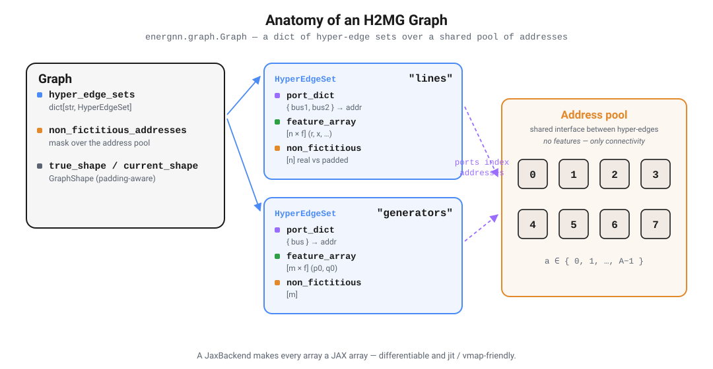
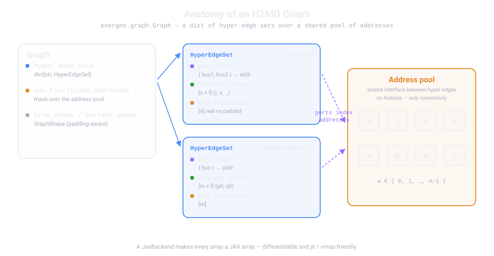
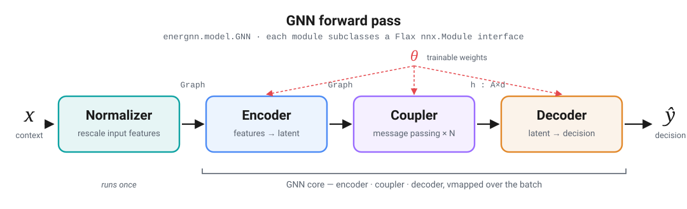
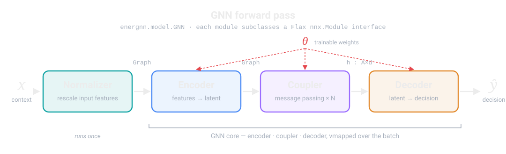

Basics
======

This page introduces the general framework of the **EnerGNN** library.

- It introduces **Amortized Optimization** [Amos2022]_ (see :term:`Amortized Optimization`), which encompasses traditional supervised learning.
- It explains how to implement your own use case using the :mod:`energnn.problem` interface.
- It outlines the core features of our :mod:`energnn.graph` data representation module (:term:`H2MG`).
- It gives some details about the GNN architectures implemented in :mod:`energnn.model`.
- It shows how to train a GNN model over your own use case using the :mod:`energnn.train` module.

.. [Amos2022] Brandon Amos, *Tutorial on Amortized Optimization*, 2022.

-----

Amortized Optimization
----------------------

Consider an optimization problem formulated as follows:

.. math::

    \begin{align}
        y^\star(x) \in \arg \min _y \ f(y;x),
    \end{align}

where:

- :math:`x` is a **context** graph (input data, see :term:`Context`),
- :math:`y` is a **decision** graph (output data, see :term:`Decision`),
- :math:`f` is the **objective function** to minimize (see :term:`Objective Function`).

We seek to solve this problem for a distribution of contexts :math:`x \sim p`,
using a trainable GNN model :math:`\hat{y}_\theta`, parameterized by :math:`\theta`.
This leads to the following **Amortized Optimization** [Amos2022]_ problem:

.. math::

    \begin{align}
        \theta^\star \in \arg \min _\theta \ \mathbb{E}_{x \sim p} [f(\hat{y}_\theta(x);x)].
    \end{align}

**EnerGNN** addresses this learning problem via the following general training loop:

.. math::

    \begin{align}
        x &\sim p & & \text{(1) Context sampling}\\
        \hat{y} &\gets \hat{y}_\theta(x) & & \text{(2) Decision inference} \\
        \hat{g} &\gets \nabla_y f(\hat{y};x) & & \text{(3) Gradient estimation} \\
        \theta &\gets \theta - \alpha \text{J}_\theta[\hat{y}_\theta]^\top \cdot \hat{g} & & \text{(4) Back-propagation}
    \end{align}

**EnerGNN** handles steps (2) and (4), which are independent of the use case, while
steps (1) and (3) are use case specific and should respect the provided :mod:`energnn.problem` interface.

The figure below summarizes how these pieces fit together.
The **amortizer** (the reusable part handled by EnerGNN) turns a context :math:`x` into a decision :math:`y`,
while each problem instance, drawn from a dataset, provides the context and feeds back the gradient
:math:`\nabla_y f(y;x)` (in red) used to update the weights :math:`\theta`.

.. image:: _static/energnn-pipeline-black.png
    :class: only-light
    :align: center
    :width: 90%
    :alt: The amortized optimization loop: a context flows through the amortizer to a decision,
          and the objective gradient flows back to update the model weights.

.. image:: _static/energnn-pipeline-white.png
    :class: only-dark
    :align: center
    :width: 90%
    :alt: The amortized optimization loop: a context flows through the amortizer to a decision,
          and the objective gradient flows back to update the model weights.

Here the **amortizer** is exactly the :class:`~energnn.model.GNN` (wrapped by a preprocessor / postprocessor for the
use case), whose internal structure is detailed in `Graph Neural Network Models`_ below.

-------------------------

Implementing your own Use Case
------------------------------

.. attention:: **Should you use EnerGNN?**

    **EnerGNN** has been designed for Amortized Optimization
    problems where the objective function :math:`f` is
    permutation-invariant (i.e., for any permutation :math:`\sigma`,
    :math:`f(\sigma(y); \sigma(x)) = f(y; x)`).
    This entails that the solution :math:`y^\star` is
    permutation-equivariant (i.e., for any permutation :math:`\sigma`,
    :math:`y^\star(\sigma(x)) = \sigma(y^\star(x))`).
    If this property is not satisfied, then resorting to a GNN is probably not a good idea.

The :mod:`energnn.problem` API provides an interface to integrate your own use cases.
A general overview is provided below, and an in-depth guide is available in :doc:`custom_use_case`.

Problem
.......

The **Problem** (:class:`~energnn.problem.Problem`) class defines a single instance of the optimization problem.
It must implement:

- :attr:`~energnn.problem.Problem.context_structure`: General structure of contexts :math:`x`.
- :attr:`~energnn.problem.Problem.decision_structure`: General structure that decisions :math:`y` should respect.
  Notice that gradients :math:`\nabla_y f` share the same structure.
- :meth:`~energnn.problem.Problem.get_context`: Returns the context graph :math:`x`.
- :meth:`~energnn.problem.Problem.get_gradient`: Computes the gradient :math:`\nabla_y f` for a given decision :math:`y`.
  Depending on the use-case, the
  gradient can either be straightforward to compute, or require more expensive Monte-Carlo computations.
- :meth:`~energnn.problem.Problem.get_score`: Evaluates the quality of a decision
  (which may or may not coincide with the objective function).

ProblemBatch
............

For training, problems are grouped into a **Problem Batch** (:class:`~energnn.problem.ProblemBatch`).
The interface is the same as for :term:`Problem`, but contexts, decisions and
gradients are batched together.

ProblemLoader
.............

The :class:`~energnn.problem.ProblemLoader` is the iterator that provides these batches to the training engine.

.. code-block:: python

    for problem_batch in train_loader:
        context, _ = problem_batch.get_context()
        # Do stuff.
        ...

------------------------

Data Representation using H2MG
------------------------------

Contexts :math:`x`, decisions :math:`y`, and gradients :math:`\nabla_y f`
are all represented as :term:`H2MGs <H2MG>` (*Hyper Heterogeneous Multi Graphs*).

- **Hyper graphs.** Made of hyper-edges that can connect more than 2 entities.
- **Heterogeneous graphs.** Multiple component types (e.g., lines, transformers, etc.).
- **Multi graphs.** Multiple components can be collocated.

.. image:: _static/energnn_h2mg_black.png
    :class: only-light

.. image:: _static/energnn_h2mg_white.png
    :class: only-dark

H2MGs are made of **hyper-edges** (*i.e.* objects), which are interconnected via **addresses**.
These addresses do not bear any numerical feature, and only serve as interface between hyper-edges, as illustrated
by the figure above.
All hyper-edges of the same class share the same feature and **port** keys.
The order of an hyper-edge is the cardinality of its **ports**.

In practice, a :class:`~energnn.graph.Graph` is a dictionary of :class:`~energnn.graph.HyperEdgeSet` objects.
For computations with JAX, construct the graph with a :class:`~energnn.graph.JaxBackend` instance,
which makes it compatible with automatic differentiation and JAX transformations.

**How it maps to the code.**
The sketch below opens up a :class:`~energnn.graph.Graph` to show the objects you actually manipulate.
A :class:`~energnn.graph.Graph` holds one :class:`~energnn.graph.HyperEdgeSet` per object class (``"lines"``,
``"generators"``, ...). Each :class:`~energnn.graph.HyperEdgeSet` stores a ``feature_array`` (the numerical
attributes) and a ``port_dict`` that maps each **port** name to an array of **addresses**. Addresses live in a
single shared pool and carry no features -- they are purely the wiring between hyper-edges. The
``non_fictitious`` masks flag padded (fictitious) objects introduced during batching, so the model can ignore them.

          port dictionary whose port arrays index into a shared pool of addresses.

          port dictionary whose port arrays index into a shared pool of addresses.

See the :doc:`tutorial_notebook` for an example of H2MG data.

--------------------------

Graph Neural Network Models
---------------------------

**EnerGNN** provides a modular and parametrizable GNN library designed to natively process H2MG data.
The main model, :class:`~energnn.model.GNN`, follows a modular pipeline:

1. **Normalizer**. Adjusts the distribution of input features (e.g., uniformly distributed between -1 and 1).
2. **Encoder**. Embeds input features into a latent space.
3. **Coupler**. Handles information propagation (e.g., via iterative message passing) over the graph structure.
4. **Decoder**. Produces the final decision from coupled latent representations.

          form the trainable core that is vmapped over the batch.

          form the trainable core that is vmapped over the batch.

Each stage is a small, swappable module, and the table below summarizes what flows between them.

.. list-table::
    :header-rows: 1
    :widths: 18 30 26 26

    * - Stage
      - Role
      - Input
      - Output
    * - :class:`~energnn.model.normalizer.Normalizer`
      - Rescale raw features to a training-friendly range.
      - Context :class:`~energnn.graph.Graph`
      - Normalized :class:`~energnn.graph.Graph`
    * - :class:`~energnn.model.encoder.Encoder`
      - Embed each hyper-edge's features into a latent space (class-specific MLPs).
      - Normalized :class:`~energnn.graph.Graph`
      - Encoded :class:`~energnn.graph.Graph`
    * - :class:`~energnn.model.coupler.Coupler`
      - Propagate information over the structure, producing one latent vector per address.
      - Encoded :class:`~energnn.graph.Graph`
      - Coordinates ``h`` of shape ``(n_addresses, latent_dim)``
    * - :class:`~energnn.model.decoder.Decoder`
      - Read the coordinates back into a decision (equivariant) or a global vector (invariant).
      - Coordinates ``h`` + encoded :class:`~energnn.graph.Graph`
      - Decision :class:`~energnn.graph.Graph` or :class:`jax.Array`

All modules inherit from :class:`flax.nnx.Module`, allowing great flexibility and perfect integration with the JAX ecosystem.
On a batch, :meth:`~energnn.model.GNN.forward_batch` runs the normalizer once and ``vmap`` s the encoder,
coupler and decoder over the batch dimension.

Inside the coupler: message passing
....................................

The **coupler** is where the graph structure is actually exploited.
The default :class:`~energnn.model.coupler.RecurrentCoupler` behaves like a simple neural ODE solver:
starting from zero coordinates, it repeatedly refines the per-address coordinates ``h`` with an explicit Euler step
:math:`h \gets h + \Delta t \cdot \phi_\theta(\psi^1_\theta, \dots, \psi^n_\theta)`.
Each **message function** :math:`\psi_\theta` gathers the coordinates sitting at the ports of every hyper-edge,
passes them (together with the edge features) through class- and port-specific MLPs, and scatter-adds the results
back onto the addresses.

.. image:: _static/energnn_message_passing_black.svg
    :class: only-light
    :align: center
    :width: 100%
    :alt: One message-passing step gathers coordinates at each edge's ports, applies per-class MLPs,
          scatter-adds messages back onto addresses, and takes an Euler update step.

.. image:: _static/energnn_message_passing_white.svg
    :class: only-dark
    :align: center
    :width: 100%
    :alt: One message-passing step gathers coordinates at each edge's ports, applies per-class MLPs,
          scatter-adds messages back onto addresses, and takes an Euler update step.

Because this update only ever uses ``gather`` / MLP / ``scatter-add`` operations -- never the order in which
addresses or objects happen to be stored -- the whole model is **permutation-equivariant** by construction
(see :term:`Permutation Equivariance`).

Ready-to-use GNN implementations are available in :mod:`energnn.model.ready_to_use`.

.. code-block:: python

    from energnn.model.ready_to_use import TinyRecurrentEquivariantGNN

    model = TinyRecurrentEquivariantGNN(
        in_structure=problem.context_structure,
        out_structure=problem.decision_structure
    )
    context, _ = problem.get_context()
    decision, _ = model(context)

Notice that the GNN needs to know about the context and decision structures defined by the use-case.

-------------------

Trainer
-------

The :class:`~energnn.trainer.Trainer` orchestrates the learning process.
It takes as input a model, a gradient transformation (via `optax`), and handles the training loop.

.. code-block:: python

    import optax

    trainer = Trainer(model=model, gradient_transformation=optax.adam(1e-3))
    trainer.train(train_loader=loader, n_epochs=10)

Additionally, evaluation can be periodically run,
checkpoints can be saved using `orbax`,
and score / infos can be monitored using an experiment tracker.

.. code-block:: python

    import orbax.checkpoint as ocp

    checkpoint_manager = ocp.CheckpointManager(directory="tmp")
    my_tracker = ...  # Implement your own

    trainer.train(
        train_loader=train_loader,
        val_loader=val_loader,
        checkpoint_manager=checkpoint_manager,
        tracker=my_tracker,
        n_epochs=10
    )

-----------------------------

Next Steps
----------

Now that you are familiar with the basics, you can:

- Follow the :doc:`tutorial_notebook` for a hands-on example.
- Learn how to implement a :doc:`custom_use_case`.
- Explore the :doc:`reference/index` for detailed API information.
